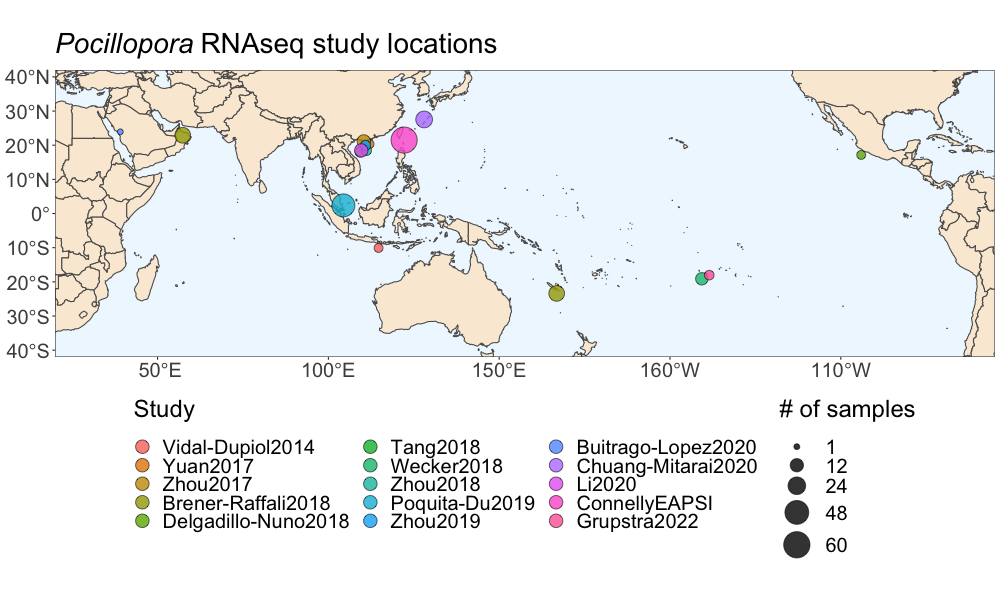
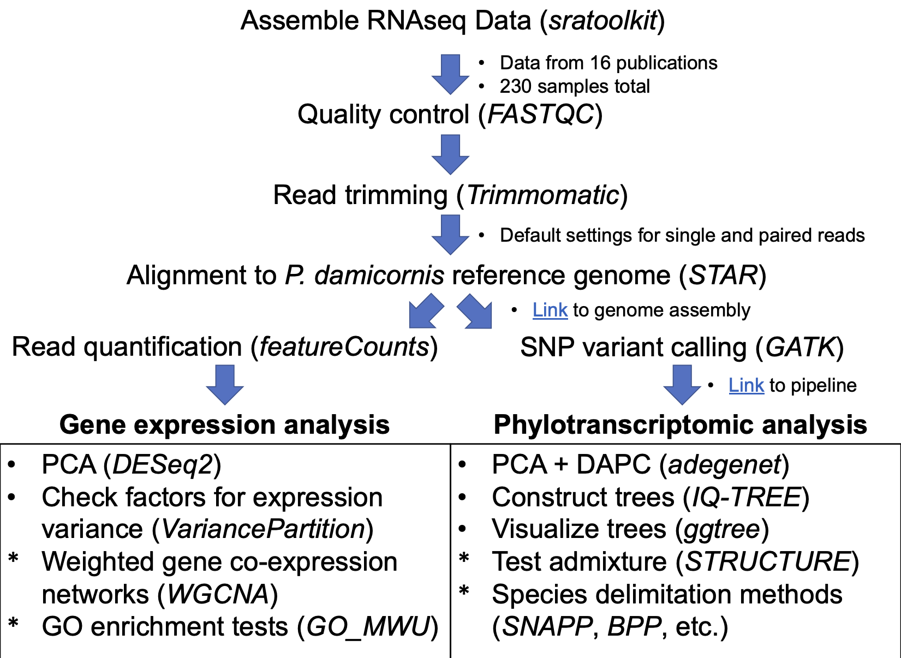

This GitHub repository contains links to data and scripts used for a meta-analysis of *Pocillopora* coral transcriptome data. This analysis was presented as a poster "Towards a modern integrative taxonomy of *Pocillopora* corals: a literature synthesis and meta-analysis of genetic data"  (#3964) at Ocean Sciences Meeting 2022.

## *Pocillopora* RNAseq studies used in meta-analysis
| Study | NCBI SRA Link |
|--|--|
| Vidal-Dupiol et al. 2014       | https://www.ncbi.nlm.nih.gov/sra/SRP029998 |
| Yuan et al. 2017               | https://www.ncbi.nlm.nih.gov/sra/PRJNA299443 |
| Zhou et al. 2017               | https://www.ncbi.nlm.nih.gov/sra/PRJNA327142 |
| Brener-Raffali et al. 2018     | https://www.ncbi.nlm.nih.gov/sra/PRJNA399069 |
| Delgadillo-Nuño et al. 2018    | https://www.ncbi.nlm.nih.gov/sra/PRJNA552592 |
| Tang et al. 2018               | https://www.ncbi.nlm.nih.gov/sra/PRJNA433950 |
| Wecker et al. 2018             | https://www.ncbi.nlm.nih.gov/sra/PRJNA369135 |
| Zhou et al. 2018               | https://www.ncbi.nlm.nih.gov/sra/PRJNA401252 |
| Poquita-Du et al. 2019         | https://www.ncbi.nlm.nih.gov/sra/PRJNA435468 |
| Zhou et al. 2019               | https://www.ncbi.nlm.nih.gov/sra/PRJNA435620 |
| Buitrago-Lopez et al. 2020     | https://www.ncbi.nlm.nih.gov/sra/PRJNA551401 |
| Chuang & Mitarai 2020          | https://www.ncbi.nlm.nih.gov/sra/PRJNA595781 |
| Li et al. 2020                 | https://www.ncbi.nlm.nih.gov/sra/PRJNA559028 |
| Connelly et al. 2020           | https://www.ncbi.nlm.nih.gov/sra/PRJNA587509 |
| Connelly et al. 2022           | https://www.ncbi.nlm.nih.gov/sra/PRJNA587509 |
| Grupstra et al. 2022           | https://www.ncbi.nlm.nih.gov/sra/PRJNA778019 |

*studies using larvae, bailed-out polyps and 3’ tagged libraries were excluded this analysis.

For a comprehensive table of *Pocillopora* population genetics studies since 1984 (not including RNAseq studies), please see "pocillopora_popgen_studies.csv""

The meta-analysis approach involved read quality control and trimming, alignment to the *P. damicornis* reference genome, followed by the Genome Analysis Toolkit RNAseq variant calling best practices pipeline.

